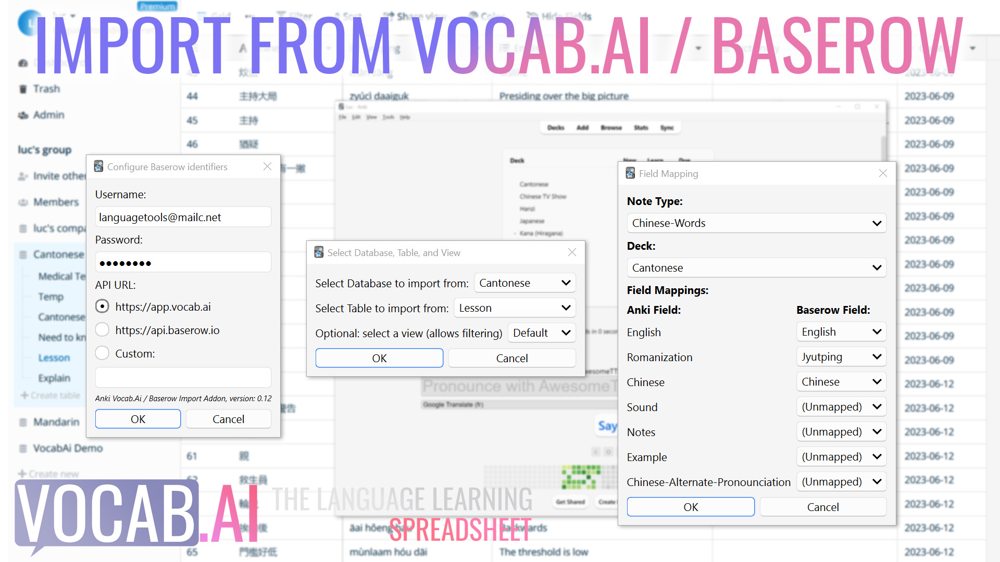

# Anki Addon: import from Vocab.Ai / Baserow
Are you a Vocab.Ai user ? This addon lets you import your sentences or vocabulary into Anki. It's also fully compatible with other Baserow instances. Configure your login/password, select database, table, and optionally select a view (which allows fine-grained filtering). Then select the Anki Deck and Note Type you wish to use, click OK to import. Your settings will be memorized to allow for easy regular importing.
# What is VocabAi?
<a href="https://app.vocab.ai" rel="nofollow">Vocab.Ai</a> is an online collaborative spreadsheet specialized for language learning. You can store foreign language vocabulary and sentences, automatically translate, transliterate and perform dictionary lookup. It is designed on top of Baserow. You can use it as your staging area for your content before importing to Anki. Related: <a href="https://medium.com/@lucw/unlock-the-power-of-pinyin-vocab-ais-edc5db83a1a9" rel="nofollow">Automatically generate Pinyin from Chinese using Vocab.Ai</a>
# What is Baserow?
<a href="https://baserow.io/" rel="nofollow">Baserow</a> is an open-source online database. It has tons of potential uses, you can think of it like an online collaborative excel, but with real database functionality.
# Any Issues?
Any issues ? Please report them here: <a href="https://github.com/Language-Tools/anki-vocabai/issues" rel="nofollow">https://github.com/Language-Tools/anki-vocabai/issues</a> or <a href="mailto:luc@vocab.ai">luc@vocab.ai</a>. Source code available here: <a href="https://github.com/Language-Tools/anki-vocabai" rel="nofollow">https://github.com/Language-Tools/anki-vocabai</a>

# How to install
Install like any other Anki Addon: [https://ankiweb.net/shared/info/111623432](https://ankiweb.net/shared/info/1327473241)
